# E-commerce Sales Customer Retention Analysis

This repository contains SQL analysis files for an e-commerce dataset focused on customer retention, revenue, category performance, and review impact.

## Files

- `01_schema.sql` - Database schema definitions and table structures.
- `02_data_quality_checks.sql` - Data quality checks and validation queries.
- `03_revenue_analysis.sql` - Revenue analysis queries and metrics.
- `04_retention_analysis.sql` - Customer retention analysis and cohort exploration.
- `05_category_geo_analysis.sql` - Category and geographic performance analysis.
- `06_review_impact_analysis.sql` - Analysis of review impact on sales and retention.

## Usage

1. Load your e-commerce dataset into a SQL database.
2. Run the SQL files in order to build schema, validate data, and generate analysis insights.
3. Adjust table names and columns as needed for your environment.

## Notes

- Designed for SQL-based analytics workflows.
- Can be adapted for tools like PostgreSQL, MySQL, SQL Server, or Snowflake.
- Add additional documentation or data source details as needed.
# 📊 Query Execution Results

## 1. Database Overview

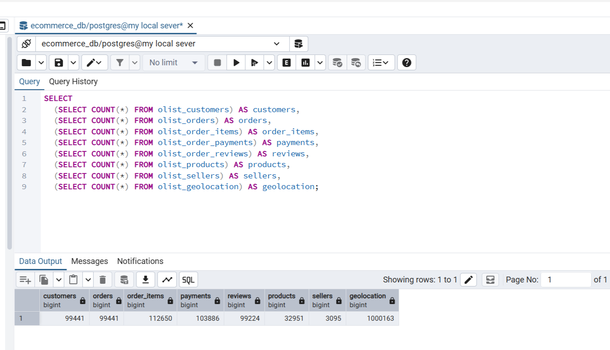

---

## 2. Monthly Revenue Trend

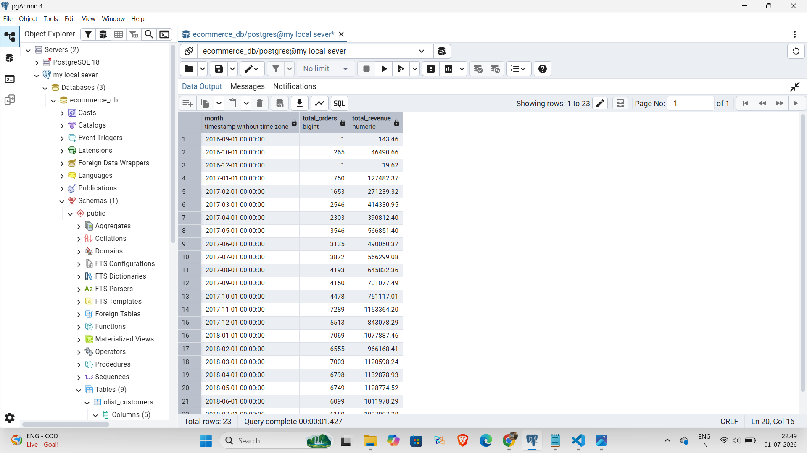

---

## 3. Repeat vs One-Time Customers

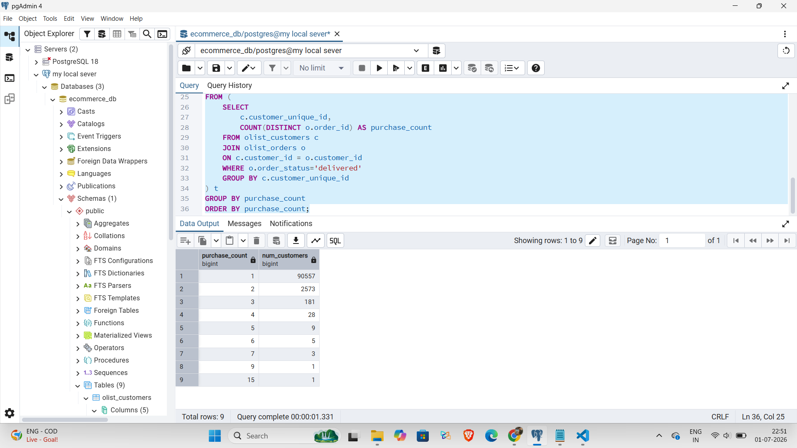

---

## 4. Repeat Purchase Rate

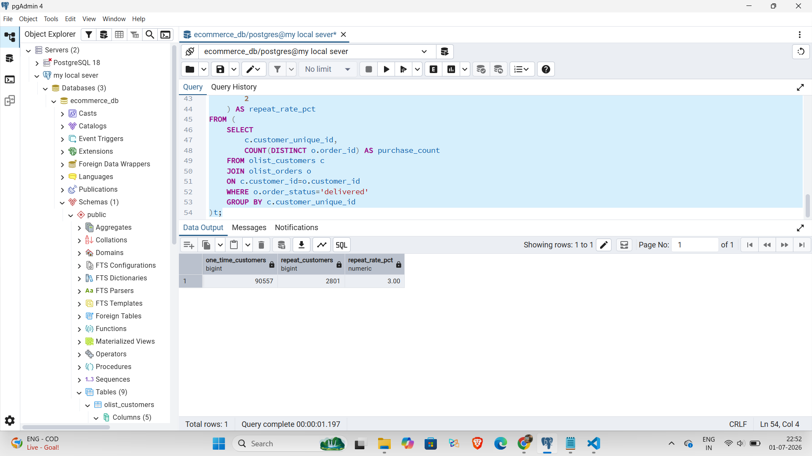

---

## 5. Cohort Retention Analysis

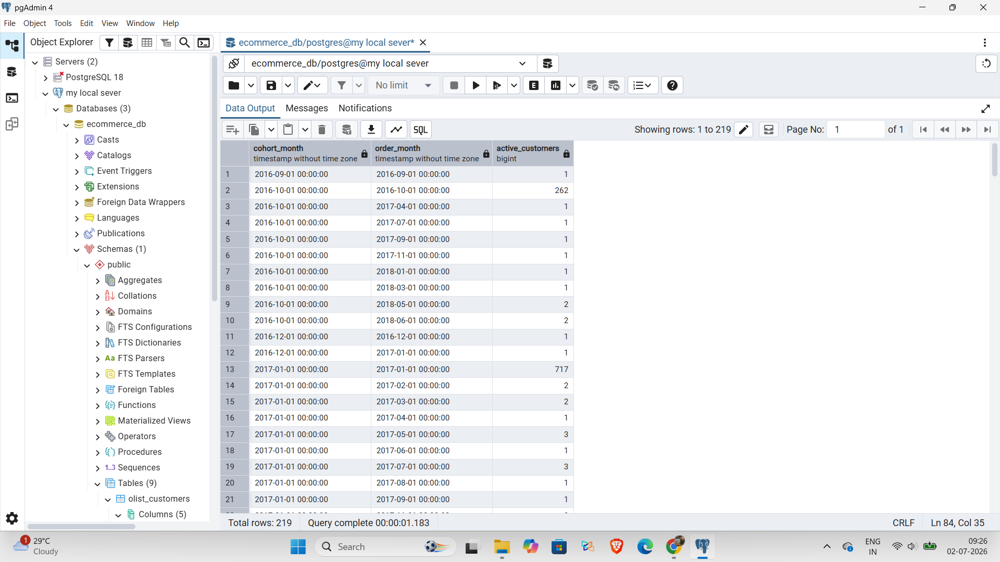

---

## 6. Top Categories by Revenue

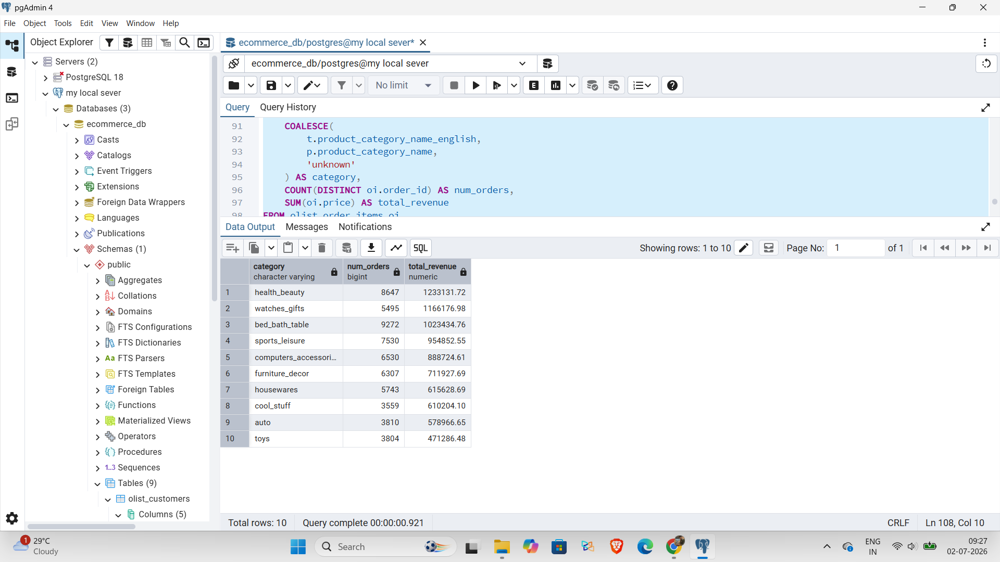

---

## 7. Average Order Value & Delivery Time

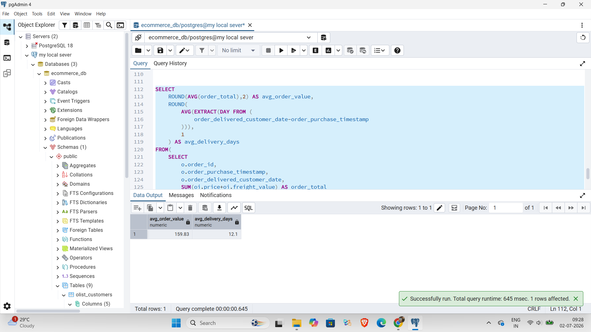

---

## 8. Revenue by State

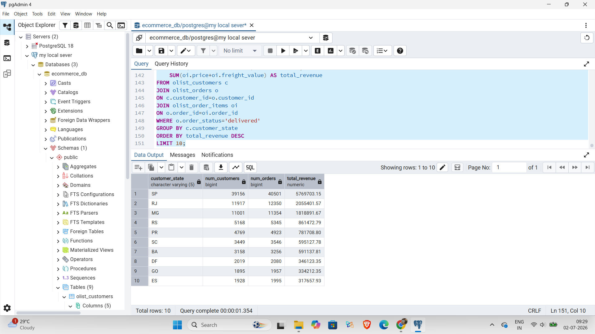

---

## 9. Review Score Distribution

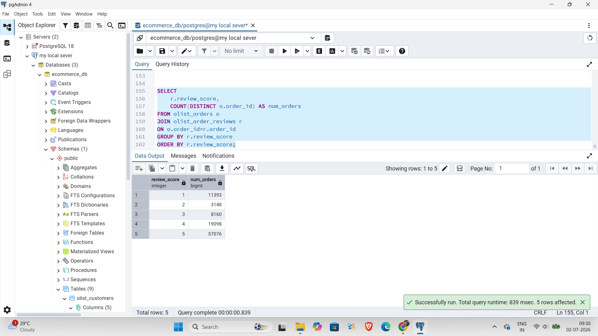

---

## 10. Review Score vs Customer Type

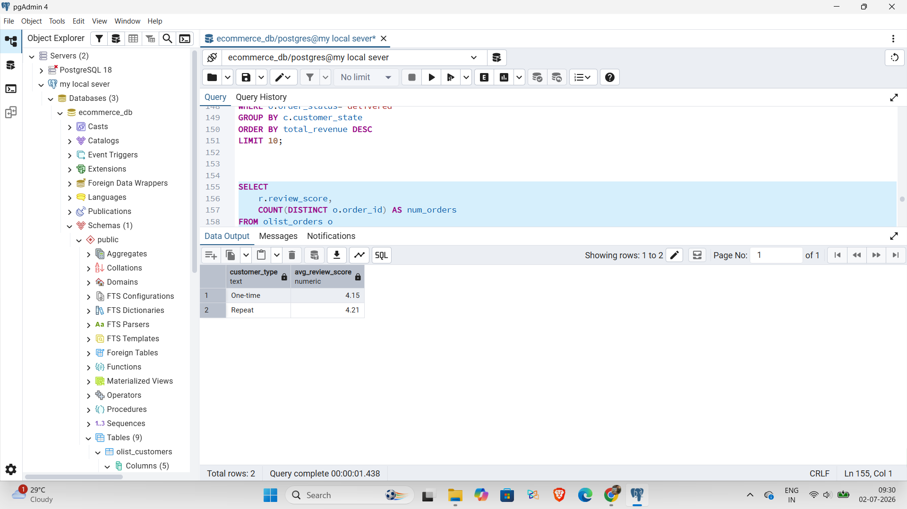

---

## 11. Top Customers by Revenue

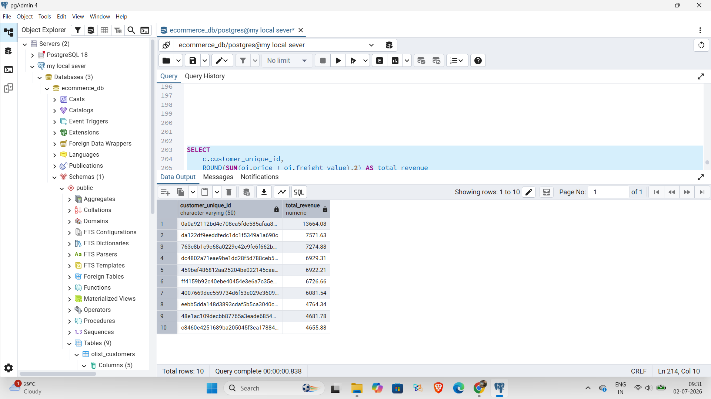

---

## 12. Top Products by Revenue

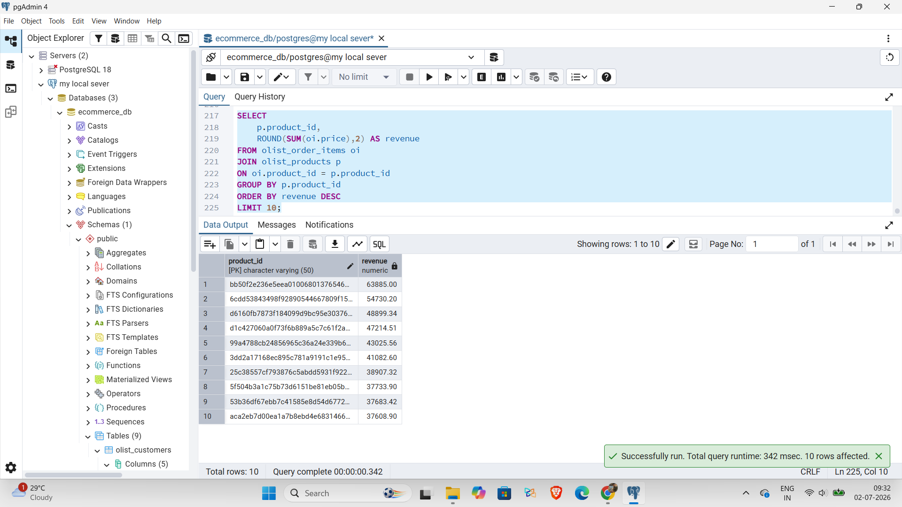
